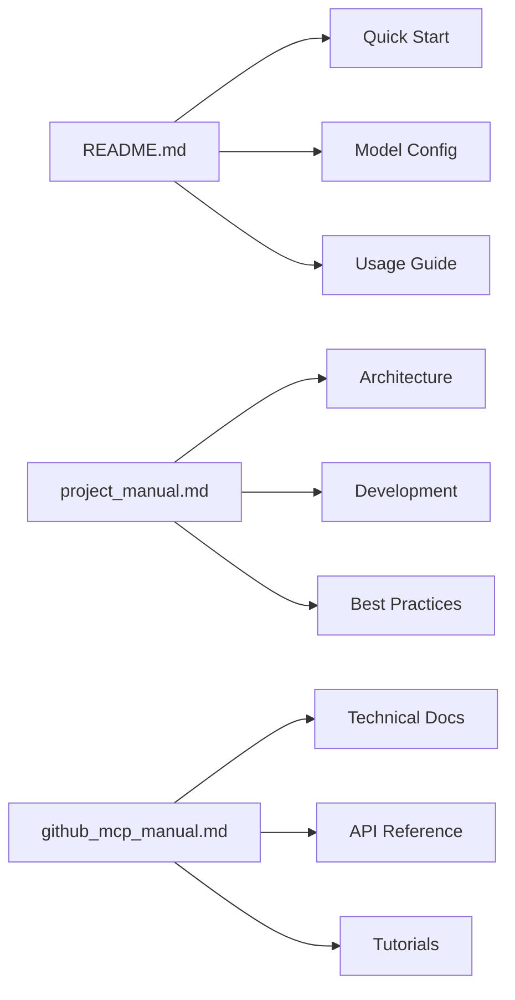

# GitHub MCP Agent with LangGraph + Azure GPT-4o + Langfuse

An intelligent GitHub assistant that demonstrates the integration of Model Context Protocol (MCP) servers with LangGraph agents, powered by Azure GPT-4o and enhanced with Langfuse observability.

## 📑 Quick Navigation

- [🚀 Quick Start](#-quick-start) - Get started quickly
- [🔄 Model Configuration](#-model-configuration) - Switch between LLM models
- [🔐 Credentials Setup](#obtaining-credentials) - Get required API keys
- [💬 How to Use](#-how-to-use) - Basic usage guide
- [🛠️ Available Tools](#️-available-github-tools) - List of GitHub operations
- [🔍 Troubleshooting](#-troubleshooting) - Common issues and solutions

## 📚 Documentation Map



## 🌟 Features

- 🤖 **Intelligent GitHub Agent**: Natural language interface for GitHub operations
- 🔧 **GitHub MCP Server**: Direct integration with GitHub's official MCP server
- ☁️ **Azure GPT-4o**: Powered by Azure OpenAI's latest GPT-4o model
- 📊 **Langfuse Observability**: Complete tracing and monitoring of agent interactions
- 🛠️ **20+ GitHub Tools**: Comprehensive set of GitHub operations (repos, issues, PRs, commits, etc.)
- 💬 **Interactive Mode**: Ask questions in natural language about any GitHub repository

## 🏗️ Architecture

```text
┌─────────────────┐    ┌─────────────────┐    ┌─────────────────┐
│   Human Query   │───▶│   LangGraph     │───▶│   Azure GPT-4o  │
│ "What branches  │    │     Agent       │    │   (Langfuse)    │
│ are in repo X?" │    │                 │    │                 │
└─────────────────┘    └─────────────────┘    └─────────────────┘
                                │                        │
                                ▼                        ▼
                       ┌─────────────────┐    ┌─────────────────┐
                       │  GitHub Tools   │───▶│  GitHub MCP     │
                       │   (LangChain)   │    │    Server       │
                       └─────────────────┘    └─────────────────┘
                                                        │
                                                        ▼
                                               ┌─────────────────┐
                                               │   GitHub API    │
                                               └─────────────────┘
```

## 📋 Prerequisites

- **Python 3.11+** (3.13+ recommended)
- **Go 1.19+** (for building the GitHub MCP server)
- **Azure OpenAI account** with GPT-4o model deployment
- **GitHub account** with Personal Access Token
- **Langfuse account** (free tier available for observability)

## 🚀 Quick Start

### Step 1: Install UV Package Manager

UV is a fast Python package manager that makes dependency management easier.

#### macOS (using Homebrew)
```bash
# Install Homebrew if you don't have it
/bin/bash -c "$(curl -fsSL https://raw.githubusercontent.com/Homebrew/install/HEAD/install.sh)"

# Install UV
brew install uv
```

#### Windows
```powershell
# Using PowerShell (recommended)
powershell -ExecutionPolicy ByPass -c "irm https://astral.sh/uv/install.ps1 | iex"

# Or using Scoop (if you have Scoop installed)
scoop install uv

# Or using pip
pip install uv
```

#### Alternative: Direct Installation
```bash
# For Unix-like systems (macOS, Linux, WSL)
curl -LsSf https://astral.sh/uv/install.sh | sh

# For Windows (PowerShell)
powershell -c "irm https://astral.sh/uv/install.ps1 | iex"
```

### Step 2: Setup Project

```bash
# Clone this repository (or download the project files)
cd demo_githubmcp

# Install dependencies using UV
uv sync

# Activate the virtual environment
source .venv/bin/activate  # macOS/Linux
# OR
.venv\Scripts\activate     # Windows
```

### Step 3: Build GitHub MCP Server

#### macOS/Linux
```bash
# Install Go if you don't have it
# macOS: brew install go
# Linux: sudo apt install golang-go

# Clone and build the GitHub MCP server
git clone https://github.com/github/github-mcp-server.git temp_github_mcp_server
cd temp_github_mcp_server
go build -o ../mcp_server/github-mcp-server ./cmd/github-mcp-server
cd ..
rm -rf temp_github_mcp_server
```

#### Windows
```powershell
# Install Go if you don't have it: https://golang.org/dl/

# Clone and build the GitHub MCP server
git clone https://github.com/github/github-mcp-server.git temp_github_mcp_server
cd temp_github_mcp_server
go build -o ..\mcp_server\github-mcp-server.exe .\cmd\github-mcp-server
cd ..
Remove-Item -Recurse -Force temp_github_mcp_server
```

### Step 4: Create Azure OpenAI Resource

1. **Sign up for Azure** if you don't have an account: https://azure.microsoft.com/
2. **Create an Azure OpenAI resource**:
   - Go to Azure Portal → Create a resource → AI + Machine Learning → Azure OpenAI
   - Choose your subscription and resource group
   - Select a region (e.g., East US, West Europe)
   - Choose pricing tier (Standard S0)
3. **Deploy GPT-4o model**:
   - Go to your Azure OpenAI resource → Model deployments
   - Click "Create new deployment"
   - Select `gpt-4o` model
   - Give it a name (e.g., "gpt-4o-deployment")
   - Set capacity as needed
4. **Get your credentials**:
   - Go to Keys and Endpoint
   - Copy the API Key and Endpoint URL

### Step 5: Create GitHub Personal Access Token

1. **Go to GitHub Settings**: https://github.com/settings/personal-access-tokens/new
2. **Create a new token** with these permissions:
   - **Repository access**: All repositories (or select specific ones)
   - **Repository permissions**:
     - Contents: Read
     - Issues: Read and Write (if you want to create/update issues)
     - Pull requests: Read
     - Metadata: Read
     - Commit statuses: Read
3. **Copy the token** (you won't see it again!)

### Step 6: Register for Langfuse (Optional but Recommended)

1. **Sign up for free**: https://cloud.langfuse.com/auth/sign-up
2. **Create a new project** after signing up
3. **Get your API keys**:
   - Go to Settings → API Keys
   - Copy the Public Key and Secret Key

### Step 7: Environment Configuration

Create your environment file:

```bash
# Copy the example file
cp .env.example .env

# Edit with your credentials
nano .env  # or use your preferred editor
```

Fill in your `.env` file:

```env
# Azure OpenAI Configuration
AZURE_OPENAI_API_KEY=your_azure_openai_api_key_here
AZURE_OPENAI_ENDPOINT=https://your-resource-name.openai.azure.com/
AZURE_OPENAI_API_VERSION=2024-12-01-preview
MODEL_NAME=gpt-4o  # or your deployment name

# GitHub Configuration
GITHUB_PERSONAL_ACCESS_TOKEN=ghp_your_github_token_here
GITHUB_HOST=https://api.github.com

# Langfuse Observability (optional but recommended)
LANGFUSE_SECRET_KEY=sk-lf-your_secret_key_here
LANGFUSE_PUBLIC_KEY=pk-lf-your_public_key_here
LANGFUSE_HOST=https://cloud.langfuse.com
```

### Step 8: Validate Your Setup

Before running the application, validate your setup:

```bash
# Run the validation script
python validate_setup.py
```

This will check:
- ✅ Python version (3.11+)
- ✅ UV installation
- ✅ Go installation  
- ✅ GitHub MCP server binary
- ✅ Environment file (.env)
- ✅ Required environment variables

### Step 9: Run the Application

```bash
# Make sure you're in the project directory and virtual environment is activated
python main.py
```

## 🔄 Model Configuration

### Available LLM Models

The system supports multiple LLM providers:

1. **Azure OpenAI Models**
   - `azure:gpt-4o` (Default, most capable)
   - `azure:gpt-4`
   - `azure:gpt-35-turbo`

2. **Ollama Models**
   - `ollama:llama2`
   - `ollama:llama3`
   - `ollama:mistral`

### How to Switch Models

1. **In main.py**
   ```python
   # Find this line (around line 37):
   llm_model_name = "azure:gpt-4o"  # Change to your preferred model
   
   # Example changes:
   llm_model_name = "azure:gpt-4"      # Use standard GPT-4
   llm_model_name = "ollama:llama3"    # Use Ollama's Llama 3
   ```

2. **Via Environment Variable**
   ```bash
   # In your .env file or command line:
   export LLM_MODEL="azure:gpt-4o"     # For Azure GPT-4
   # OR
   export LLM_MODEL="ollama:llama3"    # For Ollama
   ```

### Obtaining Credentials

#### 1. Azure OpenAI Credentials (For Azure Models)

1. **Create Azure Account**
   - Go to [Azure Portal](https://portal.azure.com)
   - Sign up if you don't have an account
   - Navigate to "Create a resource"

2. **Create Azure OpenAI Resource**
   ```mermaid
   graph TD
       A[Azure Portal] -->|Create resource| B[AI + Machine Learning]
       B -->|Select| C[Azure OpenAI]
       C -->|Configure| D[Basic Settings]
       D -->|Create| E[Resource]
       E -->|Access| F[Keys and Endpoint]
   ```

3. **Get Required Values**
   - Find your resource in Azure Portal
   - Go to "Keys and Endpoint" section
   - Copy these values:
     ```env
     AZURE_OPENAI_API_KEY=your_key_here
     AZURE_OPENAI_ENDPOINT=https://your-resource.openai.azure.com/
     AZURE_OPENAI_API_VERSION=2024-12-01-preview
     ```

#### 2. GitHub Personal Access Token

1. **Generate Token**
   - Go to [GitHub Settings → Developer Settings](https://github.com/settings/tokens)
   - Click "Generate New Token (classic)"
   - Select these permissions:
     ```
     - repo (all)
     - read:org
     - read:user
     - user:email
     ```

2. **Save Token**
   ```env
   GITHUB_PERSONAL_ACCESS_TOKEN=ghp_your_token_here
   ```

#### 3. Ollama Setup (For Ollama Models)

1. **Install Ollama**
   ```bash
   # macOS
   brew install ollama
   
   # Linux
   curl -fsSL https://ollama.com/install.sh | sh
   ```

2. **Pull Required Models**
   ```bash
   ollama pull llama2    # For llama2
   ollama pull llama3    # For llama3
   ollama pull mistral   # For mistral
   ```

3. **Configure Environment**
   ```env
   OLLAMA_BASE_URL=http://localhost:11434  # Default Ollama URL
   ```

## 💬 How to Use

Once you run `python main.py`, you'll see:

1. **Environment Check**: Verifies all required environment variables
2. **Model Configuration**: Shows selected LLM model and session info
3. **Interactive Mode**: Ask questions in natural language!

### Example Questions

```text
🔍 Your question: What branches are available in microsoft/vscode?
🔍 Your question: Show me the latest commits in openai/openai-python
🔍 Your question: What issues are open in facebook/react with label "bug"?
🔍 Your question: Find repositories about machine learning
🔍 Your question: What's in the README file of tensorflow/tensorflow?
```
    agent = await create_github_agent()
    
    response = await agent.ainvoke(
        "What are the latest 5 pull requests in microsoft/vscode?"
    )
    print(response)
```

## 🛠️ Available GitHub Tools

The agent provides access to 20+ GitHub operations through natural language:

### 🏢 Repository Operations
- **Search repositories** - Find repositories by name, topic, or language
- **List branches** - Get all branches in a repository
- **Get file contents** - Retrieve any file from a repository
- **List commits** - Get commit history
- **Get commit details** - Detailed information about specific commits

### 🔄 Pull Request Operations
- **List pull requests** - Get all PRs with filtering options
- **Get PR details** - Comprehensive PR information
- **Get PR files** - See what files changed in a PR
- **Get PR comments** - Read all comments and reviews
- **Get PR diff** - See the actual code changes

### 🐛 Issue Operations
- **List issues** - Get repository issues with filters
- **Get issue details** - Detailed issue information
- **Create issues** - Create new issues programmatically
- **Update issues** - Modify existing issues
- **Search issues** - Find issues across repositories

### 👤 User Operations
- **Get authenticated user** - Your GitHub profile information
- **Search users** - Find GitHub users

### 🏷️ Tag Operations
- **List tags** - Get repository tags/releases
- **Get tag details** - Information about specific tags

## 📚 Programming Interface

### Using the Agent Directly

```python
from src.agents.github_agent import create_github_agent

async def example():
    agent = await create_github_agent()
    
    response = await agent.ainvoke(
        "What are the latest 5 pull requests in microsoft/vscode?"
    )
    print(response)
```

### Using the Service Layer

```python
from src.services.github_service import get_github_service

async def example():
    service = await get_github_service()
    
    # Get repository branches
    branches = await service.get_repository_branches("microsoft", "vscode")
    
    # Get repository info  
    info = await service.get_repository_info("openai", "openai-python")
    
    # Get latest pull requests
    prs = await service.get_latest_pull_requests("microsoft", "TypeScript")
```

## 📁 Project Structure

```text
demo_githubmcp/
├── mcp_server/
│   └── github-mcp-server          # GitHub MCP server binary
├── src/
│   ├── agents/
│   │   ├── __init__.py
│   │   └── github_agent.py        # LangGraph agent implementation
│   ├── config/
│   │   ├── __init__.py
│   │   └── settings.py            # Configuration management
│   ├── services/
│   │   ├── __init__.py
│   │   └── github_service.py      # High-level service layer
│   └── tools/
│       ├── __init__.py
│       ├── github_tools.py        # 20+ GitHub tool implementations
│       └── mcp_client/
│           ├── __init__.py
│           └── github_client.py   # MCP client implementation
├── .env.example                   # Environment template
├── .gitignore                     # Git ignore rules
├── main.py                        # Interactive GitHub assistant
├── pyproject.toml                 # UV project configuration
├── README.md                      # This file
└── uv.lock                        # Dependency lock file
```

## 🔧 How It Works

1. **MCP Server**: GitHub's official MCP server runs as a subprocess and communicates via JSON-RPC
2. **MCP Client**: Python client that manages bidirectional communication with the MCP server
3. **LangChain Tools**: Wrapper tools that expose MCP functions to the LangGraph agent
4. **LangGraph Agent**: Orchestrates conversation flow and intelligent tool selection
5. **Azure GPT-4o**: Provides natural language understanding and response generation
6. **Langfuse**: Captures all interactions for observability, debugging, and analytics

## 🔍 Troubleshooting

### Common Issues

#### 1. Missing Environment Variables
```text
❌ Missing required environment variables:
  - AZURE_OPENAI_API_KEY
```
**Solution**: Copy `.env.example` to `.env` and fill in your credentials.

#### 2. GitHub MCP Server Not Found
```text
FileNotFoundError: GitHub MCP server binary not found
```
**Solution**: Build the MCP server following Step 3 above.

#### 3. GitHub API Permission Denied
```text
Error: 403 Forbidden
```
**Solution**: Check that your GitHub Personal Access Token has the required permissions.

#### 4. Azure OpenAI Connection Issues
```text
Error: Invalid endpoint or API key
```
**Solution**: Verify your Azure OpenAI endpoint and API key in the `.env` file.

#### 5. UV Not Found
```text
Command 'uv' not found
```
**Solution**: Install UV following Step 1 above, then restart your terminal.

### Debug Mode

Enable verbose logging:

```python
import logging
logging.basicConfig(level=logging.DEBUG)
```

View detailed traces in Langfuse: https://cloud.langfuse.com (if configured)

## 🆘 Support

- **GitHub Issues**: For bug reports and feature requests
- **Langfuse Documentation**: https://langfuse.com/docs
- **Azure OpenAI Documentation**: https://docs.microsoft.com/azure/cognitive-services/openai/
- **GitHub MCP Server**: https://github.com/github/github-mcp-server

## 🤝 Contributing

1. Fork the repository
2. Create a feature branch (`git checkout -b feature/amazing-feature`)
3. Make your changes
4. Test thoroughly
5. Commit your changes (`git commit -m 'Add amazing feature'`)
6. Push to the branch (`git push origin feature/amazing-feature`)
7. Open a Pull Request

## 📝 License

This project is for demonstration purposes. Component licenses:
- **GitHub MCP Server**: MIT License
- **LangGraph**: MIT License  
- **LangChain**: MIT License

## 📚 Resources

- [GitHub MCP Server](https://github.com/github/github-mcp-server)
- [Model Context Protocol](https://modelcontextprotocol.io/)
- [LangGraph Documentation](https://langchain-ai.github.io/langgraph/)
- [Azure OpenAI Service](https://azure.microsoft.com/products/ai-services/openai-service)
- [Langfuse Documentation](https://langfuse.com/docs)
- [UV Package Manager](https://github.com/astral-sh/uv)

---

**Happy GitHub exploring! 🚀**
