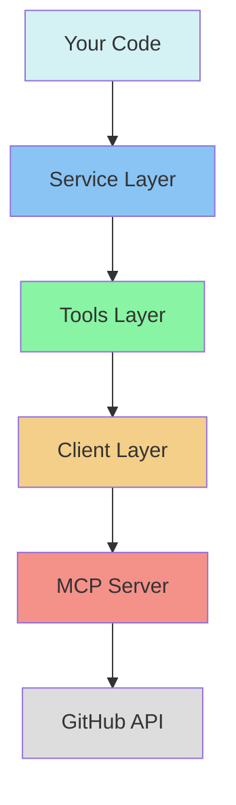
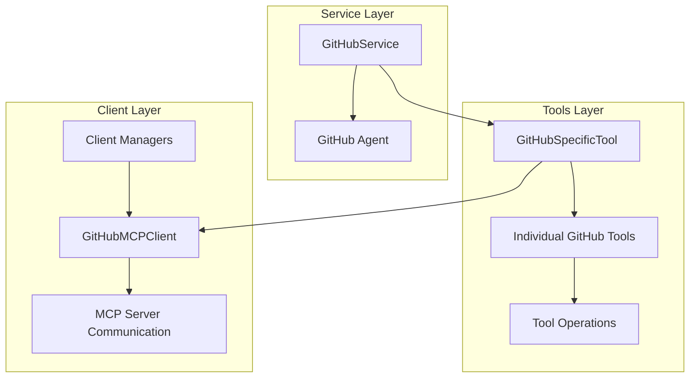

# GitHub MCP Integration Documentation

## Table of Contents
1. [Introduction](#introduction)
2. [Architecture Overview](#architecture-overview)
3. [Component Documentation](#component-documentation)
   - [Client Layer](#client-layer)
   - [Tools Layer](#tools-layer)
   - [Service Layer](#service-layer)

## Developer Guide for New Team Members

### Understanding the Architecture

#### 1. System Components Explained
The GitHub MCP integration is built in layers, making it easier to understand and maintain:



Each layer has a specific responsibility:
- **Service Layer**: Your main entry point - makes everything easy to use
- **Tools Layer**: Contains specific GitHub operations
- **Client Layer**: Handles communication with the server
- **MCP Server**: Talks directly to GitHub

#### 2. Key Concepts for Beginners

**Async/Await Pattern**
```python
# Wrong way ❌
def get_repo():
    service = get_github_service()  # This won't work!
    return service.get_repository_info()

# Right way ✅
async def get_repo():
    service = await get_github_service()
    return await service.get_repository_info()
```

**Context Managers**
```python
# Wrong way ❌
client = GitHubMCPClient()
client.start()
# ... do stuff
client.stop()

# Right way ✅
async with GitHubMCPClient() as client:
    # ... do stuff
    # Automatically handles start/stop
```

#### 3. Common Patterns

**Error Handling Best Practices**
```python
async def safe_github_operation():
    try:
        async with GitHubMCPClient() as client:
            result = await client.call_tool("get_repository", {
                "owner": "username",
                "repo": "repository"
            })
            return result
    except FileNotFoundError:
        # Handle missing MCP server
        print("Please check if MCP server is installed")
    except RuntimeError as e:
        if "rate limit" in str(e):
            print("Please wait before trying again")
        else:
            print(f"Operation failed: {e}")
```

### Quick Start Examples

1. **Basic Repository Operations**
```python
from src.services.github_service import get_github_service

async def basic_operations():
    # Get the service (this is your main entry point)
    service = await get_github_service()
    
    # Get repository information
    repo = await service.get_repository_info(
        owner="microsoft",
        repo="vscode"
    )
    
    # Get recent pull requests
    prs = await service.get_latest_pull_requests(
        owner="microsoft",
        repo="vscode",
        limit=5  # Get 5 most recent PRs
    )
```

2. **Working with Multiple Operations**
```python
async def analyze_repository(owner: str, repo: str):
    """Example of combining multiple operations"""
    service = await get_github_service()
    
    # Gather different types of information
    results = {
        "info": await service.get_repository_info(owner, repo),
        "prs": await service.get_latest_pull_requests(owner, repo, limit=3),
        "commits": await service.get_recent_commits(owner, repo, limit=5)
    }
    
    return results
```

3. **Handling Different Response Types**
```python
async def process_github_data():
    service = await get_github_service()
    
    # Get repository info (returns JSON string)
    repo_info = await service.get_repository_info("owner", "repo")
    repo_data = json.loads(repo_info)  # Convert to dict
    
    # Work with the data
    print(f"Stars: {repo_data.get('stargazers_count')}")
    print(f"Language: {repo_data.get('language')}")
```

### Tips for Development

1. **Authentication Setup**
   ```bash
   # Set your token in the terminal
   export GITHUB_PERSONAL_ACCESS_TOKEN=your_token
   
   # Or in Python (not recommended for production)
   os.environ["GITHUB_PERSONAL_ACCESS_TOKEN"] = "your_token"
   ```
## Step-by-Step Tutorials

### Tutorial 1: Setting Up a PR Review System
This tutorial shows how to create a pull request review system:

1. **Step 1: Setup Initial Configuration**
```python
from src.services.github_service import get_github_service
from datetime import datetime

async def setup_pr_review_system(owner: str, repo: str):
    service = await get_github_service()
    return service
```

2. **Step 2: Fetch Pull Requests**
```python
async def get_pending_prs(service, owner: str, repo: str):
    """Get PRs that need review"""
    prs = await service.get_latest_pull_requests(
        owner=owner,
        repo=repo,
        limit=10
    )
    return json.loads(prs)
```

3. **Step 3: Analyze PR Content**
```python
async def analyze_pr(service, owner: str, repo: str, pr_number: int):
    """Get detailed PR analysis"""
    # Get PR details
    pr_summary = await service.summarize_pull_request(
        owner=owner,
        repo=repo,
        pr_number=pr_number
    )
    
    # Get PR files
    async with GitHubMCPClient() as client:
        files = await client.call_tool("get_pull_request_files", {
            "owner": owner,
            "repo": repo,
            "pullNumber": pr_number
        })
    
    return {
        "summary": json.loads(pr_summary),
        "files": files
    }
```

4. **Step 4: Create Review Summary**
```python
async def create_review_summary(pr_analysis):
    """Format review information"""
    summary = pr_analysis["summary"]
    files = pr_analysis["files"]
    
    review_template = f"""
## Pull Request Review Summary
- Title: {summary['title']}
- Author: {summary['user']['login']}
- Created: {datetime.fromisoformat(summary['created_at']).strftime('%Y-%m-%d %H:%M')}

### Changes Overview
- Files Changed: {len(files)}
- Additions: {sum(f['additions'] for f in files)}
- Deletions: {sum(f['deletions'] for f in files)}

### Modified Files
{chr(10).join(f"- {f['filename']}" for f in files)}
    """
    return review_template
```

5. **Step 5: Complete Workflow**
```python
async def run_pr_review_workflow(owner: str, repo: str):
    """Complete PR review workflow"""
    service = await setup_pr_review_system(owner, repo)
    
    # Get pending PRs
    prs = await get_pending_prs(service, owner, repo)
    
    reviews = []
    for pr in prs:
        # Analyze each PR
        analysis = await analyze_pr(
            service,
            owner,
            repo,
            pr['number']
        )
        
        # Create review summary
        review = await create_review_summary(analysis)
        reviews.append(review)
    
    return reviews

# Usage
reviews = await run_pr_review_workflow("owner", "repo")
for review in reviews:
    print(review)
```

### Tutorial 2: Repository Health Check System

1. **Step 1: Setup Health Check Configuration**
```python
from typing import Dict, Any
from collections import defaultdict

class RepoHealthCheck:
    def __init__(self, owner: str, repo: str):
        self.owner = owner
        self.repo = repo
        self.metrics = defaultdict(dict)
```

2. **Step 2: Implement Health Checks**
```python
async def check_activity(self):
    """Check repository activity"""
    service = await get_github_service()
    
    # Get recent commits
    commits = await service.get_recent_commits(
        self.owner,
        self.repo,
        limit=50
    )
    
    # Get recent PRs
    prs = await service.get_latest_pull_requests(
        self.owner,
        self.repo,
        limit=30
    )
    
    self.metrics["activity"] = {
        "recent_commits": len(json.loads(commits)),
        "open_prs": len(json.loads(prs))
    }
```

3. **Step 3: Add Code Health Metrics**
```python
async def check_code_health(self):
    """Check code-related metrics"""
    async with GitHubMCPClient() as client:
        # Get languages
        langs = await client.call_tool("get_languages", {
            "owner": self.owner,
            "repo": self.repo
        })
        
        # Get contributors
        contributors = await client.call_tool("get_contributors", {
            "owner": self.owner,
            "repo": self.repo
        })
        
    self.metrics["code_health"] = {
        "languages": langs,
        "active_contributors": len(contributors)
    }
```

4. **Step 4: Generate Health Report**
```python
def generate_report(self) -> str:
    """Generate formatted health report"""
    report = f"""
# Repository Health Report
Repository: {self.owner}/{self.repo}

## Activity Metrics
- Recent Commits: {self.metrics["activity"]["recent_commits"]}
- Open Pull Requests: {self.metrics["activity"]["open_prs"]}

## Code Health
- Active Contributors: {self.metrics["code_health"]["active_contributors"]}
- Languages: {', '.join(self.metrics["code_health"]["languages"].keys())}

## Recommendations
{self._generate_recommendations()}
    """
    return report

def _generate_recommendations(self) -> str:
    """Generate recommendations based on metrics"""
    recs = []
    
    if self.metrics["activity"]["recent_commits"] < 10:
        recs.append("- Repository shows low commit activity")
    
    if self.metrics["code_health"]["active_contributors"] < 3:
        recs.append("- Consider recruiting more contributors")
        
    return "\n".join(recs) if recs else "- No immediate concerns"
```

5. **Step 5: Complete Health Check Workflow**
```python
async def run_health_check(owner: str, repo: str):
    """Run complete health check workflow"""
    checker = RepoHealthCheck(owner, repo)
    
    # Run checks
    await checker.check_activity()
    await checker.check_code_health()
    
    # Generate report
    report = checker.generate_report()
    return report

# Usage
report = await run_health_check("owner", "repo")
print(report)
```

### Tutorial 3: Automated Issue Management

1. **Step 1: Setup Issue Tracking**
```python
class IssueTracker:
    def __init__(self, owner: str, repo: str):
        self.owner = owner
        self.repo = repo
        self.client = None
```

2. **Step 2: Implement Issue Management**
```python
async def setup(self):
    """Initialize the client"""
    self.client = await get_github_service()

async def get_issue_stats(self):
    """Get issue statistics"""
    async with GitHubMCPClient() as client:
        issues = await client.call_tool("list_issues", {
            "owner": self.owner,
            "repo": self.repo,
            "state": "all"
        })
    
    # Analyze issues
    stats = {
        "total": len(issues),
        "open": sum(1 for i in issues if i["state"] == "open"),
        "closed": sum(1 for i in issues if i["state"] == "closed"),
        "labels": defaultdict(int)
    }
    
    for issue in issues:
        for label in issue["labels"]:
            stats["labels"][label["name"]] += 1
    
    return stats
```

3. **Step 3: Add Issue Management Functions**
```python
async def create_tracking_issue(self, title: str, body: str):
    """Create a tracking issue"""
    async with GitHubMCPClient() as client:
        issue = await client.call_tool("create_issue", {
            "owner": self.owner,
            "repo": self.repo,
            "title": title,
            "body": body,
            "labels": ["tracking"]
        })
    return issue

async def update_issue_status(self, number: int, state: str):
    """Update issue status"""
    async with GitHubMCPClient() as client:
        updated = await client.call_tool("update_issue", {
            "owner": self.owner,
            "repo": self.repo,
            "issueNumber": number,
            "state": state
        })
    return updated
```

4. **Step 4: Complete Issue Management Workflow**
```python
async def run_issue_management(owner: str, repo: str):
    """Complete issue management workflow"""
    tracker = IssueTracker(owner, repo)
    await tracker.setup()
    
    # Get current stats
    stats = await tracker.get_issue_stats()
    
    # Create summary issue
    summary = f"""
## Issue Management Summary

Current Statistics:
- Total Issues: {stats['total']}
- Open Issues: {stats['open']}
- Closed Issues: {stats['closed']}

Label Distribution:
{chr(10).join(f'- {label}: {count}' for label, count in stats['labels'].items())}
    """
    
    tracking_issue = await tracker.create_tracking_issue(
        title="Weekly Issue Summary",
        body=summary
    )
    
    return {
        "stats": stats,
        "tracking_issue": tracking_issue
    }

# Usage
result = await run_issue_management("owner", "repo")
print(f"Created tracking issue #{result['tracking_issue']['number']}")
```

These tutorials provide step-by-step implementations of common workflows that developers might need to implement using the GitHub MCP integration. Each tutorial breaks down the process into manageable steps and includes complete, working code examples.

2. **Debugging Tips**
   - Check token permissions if operations fail
   - Use try/except to catch specific errors
   - Monitor rate limiting headers
   - Keep service instances alive for multiple operations

3. **Performance Best Practices**
   - Reuse service instances
   - Batch operations when possible
   - Implement caching for frequently used data
   - Handle rate limiting gracefully

Now, let's dive into the detailed technical documentation:
## Introduction
This documentation provides a comprehensive guide to the GitHub MCP (Model Context Protocol) integration implementation. The system is designed to provide a robust interface for interacting with GitHub's API through a structured MCP server architecture.

## Architecture Overview

The GitHub MCP integration consists of three main layers:



## Component Documentation

### Client Layer

#### GitHubMCPClient Class
The [`GitHubMCPClient`](src/tools/mcp_client/github_client.py) class provides direct communication with the GitHub MCP server through subprocess-based IPC.

**Class Attributes:**
```python
class GitHubMCPClient:
    settings: Settings  # Application configuration
    process: Optional[subprocess.Popen]  # MCP server process
    tools: List[GitHubTool]  # Available GitHub tools
```

**Core Methods:**

1. **Constructor and Context Management**
```python
async def __init__(self):
    """Initialize client with settings"""
    
async def __aenter__(self) -> GitHubMCPClient:
    """Async context manager entry - starts the client"""
    
async def __aexit__(self, exc_type, exc_val, exc_tb):
    """Async context manager exit - stops the client"""
```

2. **Server Management**
```python
async def start(self):
    """
    Start the GitHub MCP server process
    Raises:
    - FileNotFoundError: If MCP server binary not found
    - RuntimeError: If initialization fails
    """

async def stop(self):
    """
    Gracefully stop the MCP server
    - Attempts graceful termination first
    - Forces kill if termination times out
    """
```

3. **Tool Operations**
```python
async def call_tool(self, tool_name: str, arguments: Dict[str, Any]) -> Dict[str, Any]:
    """
    Execute a GitHub tool operation
    
    Args:
        tool_name: Name of the tool to execute
        arguments: Tool-specific arguments
        
    Returns:
        Dict containing the tool execution results
        
    Raises:
        RuntimeError: If process not started or tool call fails
    """

def get_available_tools(self) -> List[GitHubTool]:
    """
    Get list of available GitHub tools
    
    Returns:
        List of GitHubTool objects with tool metadata
    """
```

4. **Communication Methods**
```python
async def _send_request(self, request: Dict[str, Any]):
    """
    Send JSON-RPC request to server
    
    Args:
        request: JSON-RPC request object
        
    Raises:
        RuntimeError: If process not started
    """

async def _read_response(self) -> Dict[str, Any]:
    """
    Read JSON-RPC response from server
    
    Returns:
        Parsed JSON response
        
    Raises:
        RuntimeError: If no response or invalid JSON
    """
```

**Error Handling:**
- FileNotFoundError: When MCP server binary is missing
- RuntimeError: For communication/initialization failures
- JSONDecodeError: For invalid responses
- TimeoutError: When process termination times out

**Usage Example:**
```python
async with GitHubMCPClient() as client:
    try:
        result = await client.call_tool("get_repository", {
            "owner": "username",
            "repo": "repository"
        })
    except RuntimeError as e:
        print(f"Tool execution failed: {e}")
    except Exception as e:
        print(f"Unexpected error: {e}")
```

**Client Managers:**
- [`GitHubMCPClientManager`](src/tools/mcp_client/github_client.py): Context manager for automatic cleanup
- [`SimpleMCPClientManager`](src/tools/mcp_client/github_client.py): Simplified client management without global state
- [`PersistentGitHubMCPClient`](src/tools/mcp_client/github_client.py): Creates new connections per use

### Tools Layer

#### Base Tool Structure
The [`GitHubSpecificTool`](src/tools/github_tools.py) class serves as the foundation for all GitHub tools, implementing the LangChain BaseTool interface.

**Base Class Implementation:**
```python
class GitHubSpecificTool(BaseTool):
    """
    Base class for all GitHub-specific tools
    Inherits from LangChain's BaseTool for agent integration
    """
    def __init__(self, tool_name: str, description: str, args_schema: Type[BaseModel]):
        self._tool_name = tool_name
        self._client: Optional[GitHubMCPClient] = None
```

**Tool Categories and Input Schemas:**

1. **Repository Management**
```python
# List Branches
class ListBranchesInput(BaseModel):
    owner: str = Field(description="Repository owner")
    repo: str = Field(description="Repository name")
    page: Optional[int] = Field(description="Page number")
    perPage: Optional[int] = Field(description="Results per page")

# Get Repository
class GetRepositoryInput(BaseModel):
    owner: str = Field(description="Repository owner")
    repo: str = Field(description="Repository name")

# Get File Contents
class GetFileContentsInput(BaseModel):
    owner: str = Field(description="Repository owner")
    repo: str = Field(description="Repository name")
    path: str = Field(description="File path")
    ref: Optional[str] = Field(description="Git reference")
```

2. **Pull Request Operations**
```python
# Get Pull Request
class GetPullRequestInput(BaseModel):
    owner: str = Field(description="Repository owner")
    repo: str = Field(description="Repository name")
    pullNumber: int = Field(description="Pull request number")

# List Pull Requests
class ListPullRequestsInput(BaseModel):
    owner: str = Field(description="Repository owner")
    repo: str = Field(description="Repository name")
    state: Optional[str] = Field(default="open")
    sort: Optional[str] = Field(description="Sort field")
    direction: Optional[str] = Field(description="Sort direction")
```

3. **Issue Management**
```python
# Create Issue
class CreateIssueInput(BaseModel):
    owner: str = Field(description="Repository owner")
    repo: str = Field(description="Repository name")
    title: str = Field(description="Issue title")
    body: Optional[str] = Field(description="Issue body")
    labels: Optional[List[str]] = Field(description="Label names")

# Update Issue
class UpdateIssueInput(BaseModel):
    owner: str = Field(description="Repository owner")
    repo: str = Field(description="Repository name")
    issueNumber: int = Field(description="Issue number")
    state: Optional[str] = Field(description="Issue state")
```

4. **Search Capabilities**
```python
# Search Repositories
class SearchRepositoriesInput(BaseModel):
    query: str = Field(description="Search query")
    sort: Optional[str] = Field(description="Sort field")
    order: Optional[str] = Field(description="Sort order")
    
# Search Code
class SearchCodeInput(BaseModel):
    query: str = Field(description="Code search query")
    sort: Optional[str] = Field(description="Sort field")
```

**Common Tool Operations:**

1. **Tool Execution Flow**
```python
async def _arun(self, *args, **kwargs) -> str:
    """
    Execute the tool with error handling
    
    Args:
        *args: Positional arguments mapped to schema fields
        **kwargs: Keyword arguments for tool operation
        
    Returns:
        str: JSON-formatted result or error message
        
    Raises:
        Exception: For tool execution failures
    """
```

2. **Error Handling**
- Invalid input validation
- MCP client connection failures
- Tool execution errors
- Response parsing errors

**Tool Usage Examples:**

1. **Repository Operations**
```python
# List repository branches
branches_tool = ListBranchesTool()
result = await branches_tool._arun(
    owner="username",
    repo="repository",
    page=1,
    perPage=100
)

# Get file contents
contents_tool = GetFileContentsTool()
result = await contents_tool._arun(
    owner="username",
    repo="repository",
    path="src/main.py",
    ref="main"
)
```

2. **Issue Management**
```python
# Create new issue
issue_tool = CreateIssueTool()
result = await issue_tool._arun(
    owner="username",
    repo="repository",
    title="Bug Report",
    body="Description of the issue",
    labels=["bug", "priority"]
)
```

### Service Layer

#### GitHubService Class
The [`GitHubService`](src/services/github_service.py) class provides high-level operations for GitHub interactions through an agent-based interface.

**Class Structure:**
```python
class GitHubService:
    """High-level service for GitHub operations"""
    agent: Optional[GitHubAgent]  # GitHub agent instance
```

**Core Operations:**

1. **Agent Management**
```python
async def _get_agent(self) -> GitHubAgent:
    """
    Get or create the GitHub agent
    
    Returns:
        GitHubAgent instance with configured session parameters
        
    Notes:
        - Uses shared session context for consistent tracing
        - Maintains service-specific user ID
    """
```

2. **Question Handling**
```python
async def ask_question(self, question: str) -> str:
    """
    Ask a question about GitHub repositories
    
    Args:
        question: Natural language question about GitHub
        
    Returns:
        Formatted response from the GitHub agent
        
    Notes:
        - Generates unique message ID for tracing
        - Handles agent invocation and response formatting
    """
```

3. **Repository Operations**
```python
async def get_repository_info(self, owner: str, repo: str) -> str:
    """
    Get comprehensive repository information
    
    Args:
        owner: Repository owner
        repo: Repository name
        
    Returns:
        Formatted repository details
    """

async def get_repository_branches(self, owner: str, repo: str) -> str:
    """
    Get branches for a specific repository
    
    Args:
        owner: Repository owner
        repo: Repository name
        
    Returns:
        List of repository branches
    """
```

4. **Pull Request Operations**
```python
async def get_latest_pull_requests(
    self,
    owner: str,
    repo: str,
    limit: int = DEFAULT_PR_LIMIT
) -> str:
    """
    Get latest pull requests for a repository
    
    Args:
        owner: Repository owner
        repo: Repository name
        limit: Maximum number of PRs to return (default: 5)
        
    Returns:
        Recent pull requests details
    """

async def summarize_pull_request(
    self,
    owner: str,
    repo: str,
    pr_number: int
) -> str:
    """
    Get detailed summary of a specific pull request
    
    Args:
        owner: Repository owner
        repo: Repository name
        pr_number: Pull request number
        
    Returns:
        Comprehensive PR summary
    """
```

5. **Commit Operations**
```python
async def get_recent_commits(
    self,
    owner: str,
    repo: str,
    limit: int = DEFAULT_COMMIT_LIMIT
) -> str:
    """
    Get recent commits for a repository
    
    Args:
        owner: Repository owner
        repo: Repository name
        limit: Maximum number of commits (default: 10)
        
    Returns:
        Recent commit history
    """
```

6. **Search Operations**
```python
async def search_repositories(
    self,
    query: str,
    limit: int = DEFAULT_PR_LIMIT
) -> str:
    """
    Search for repositories
    
    Args:
        query: Search query string
        limit: Maximum results to return
        
    Returns:
        Matching repositories
    """
```

7. **File Operations**
```python
async def get_file_content(
    self,
    owner: str,
    repo: str,
    file_path: str,
    ref: str = DEFAULT_BRANCH
) -> str:
    """
    Get content of a specific file
    
    Args:
        owner: Repository owner
        repo: Repository name
        file_path: Path to file
        ref: Git reference (default: main)
        
    Returns:
        File content or error message
    """
```

**Error Handling:**
- Agent initialization failures
- Invalid parameter validation
- API response handling
- Rate limiting and throttling

**Service Instance Management:**
```python
async def get_github_service() -> GitHubService:
    """
    Get the GitHub service singleton
    
    Returns:
        Shared GitHubService instance
        
    Notes:
        - Maintains single service instance
        - Handles lazy initialization
    """
```

**Usage Examples:**

1. **Basic Repository Operations**
```python
service = await get_github_service()

# Get repository information
repo_info = await service.get_repository_info(
    owner="username",
    repo="repository"
)

# Get recent pull requests
prs = await service.get_latest_pull_requests(
    owner="username",
    repo="repository",
    limit=10
)
```

2. **Search and Content Operations**
```python
# Search repositories
results = await service.search_repositories(
    query="language:python stars:>1000",
    limit=5
)

# Get file content
content = await service.get_file_content(
    owner="username",
    repo="repository",
    file_path="src/main.py",
    ref="main"
)
```

## Usage Examples

### Client Layer Example
```python
async with GitHubMCPClientManager() as client:
    tools = client.get_available_tools()
    result = await client.call_tool("get_repository", {
        "owner": "username",
        "repo": "repository"
    })
```

### Tools Layer Example
```python
# Creating a specific tool instance
repo_tool = GetRepositoryTool()
result = await repo_tool._arun(
    owner="username",
    repo="repository"
)
```

### Service Layer Example
```python
github_service = await get_github_service()
repo_info = await github_service.get_repository_info(
    owner="username",
    repo="repository"
)
```

For detailed information about specific components, refer to the corresponding source files:
- [GitHub Client Implementation](src/tools/mcp_client/github_client.py)
- [GitHub Tools Implementation](src/tools/github_tools.py)
- [GitHub Service Implementation](src/services/github_service.py)
## Common Use Cases and Examples

This section provides practical examples of common GitHub operations using the MCP integration.

### 1. Repository Analysis
This example demonstrates how to analyze a repository's structure and activity:

```python
async def analyze_repository(owner: str, repo: str):
    """Comprehensive repository analysis"""
    service = await get_github_service()
    
    # Get basic repository information
    repo_info = await service.get_repository_info(owner, repo)
    
    # Get recent activity
    commits = await service.get_recent_commits(owner, repo, limit=10)
    branches = await service.get_repository_branches(owner, repo)
    prs = await service.get_latest_pull_requests(owner, repo, limit=5)
    
    analysis = {
        "repository": json.loads(repo_info),
        "recent_commits": json.loads(commits),
        "active_branches": json.loads(branches),
        "open_prs": json.loads(prs)
    }
    return analysis

# Usage
analysis = await analyze_repository("microsoft", "vscode")
```

### 2. Pull Request Review Workflow
Example of setting up a PR review workflow:

```python
async def review_pull_request(owner: str, repo: str, pr_number: int):
    """Analyze a pull request for review"""
    service = await get_github_service()
    
    # Get PR details
    pr_summary = await service.summarize_pull_request(owner, repo, pr_number)
    
    # Get PR files using direct tool access
    async with GitHubMCPClient() as client:
        files = await client.call_tool("get_pull_request_files", {
            "owner": owner,
            "repo": repo,
            "pullNumber": pr_number
        })
        
        # Get PR diff
        diff = await client.call_tool("get_pull_request_diff", {
            "owner": owner,
            "repo": repo,
            "pullNumber": pr_number
        })
    
    return {
        "summary": json.loads(pr_summary),
        "changed_files": files,
        "diff": diff
    }

# Usage
review = await review_pull_request("owner", "repo", 123)
```

### 3. Code Search and Analysis
Example of searching and analyzing code patterns:

```python
async def search_code_patterns(query: str, lang: str = "python"):
    """Search for code patterns across repositories"""
    service = await get_github_service()
    
    # Search for code
    async with GitHubMCPClient() as client:
        results = await client.call_tool("search_code", {
            "query": f"language:{lang} {query}",
            "sort": "indexed",
            "order": "desc"
        })
        
        # Analyze first 5 results
        analysis = []
        for result in results.get("items", [])[:5]:
            content = await service.get_file_content(
                result["repository"]["owner"]["login"],
                result["repository"]["name"],
                result["path"]
            )
            analysis.append({
                "file": result["path"],
                "repo": result["repository"]["full_name"],
                "content": content
            })
    
    return analysis

# Usage
patterns = await search_code_patterns("def parse_json", "python")
```

### 4. Repository Monitoring
Example of setting up repository monitoring:

```python
async def monitor_repository_activity(owner: str, repo: str):
    """Monitor repository activity"""
    service = await get_github_service()
    
    async with GitHubMCPClient() as client:
        # Get repository stats
        stats = await client.call_tool("get_stats", {
            "owner": owner,
            "repo": repo
        })
        
        # Get contributor activity
        contributors = await client.call_tool("get_contributors", {
            "owner": owner,
            "repo": repo,
            "anon": True
        })
        
        # Get languages
        languages = await client.call_tool("get_languages", {
            "owner": owner,
            "repo": repo
        })
    
    # Get recent activity
    commits = await service.get_recent_commits(owner, repo, limit=20)
    
    return {
        "statistics": stats,
        "contributors": contributors,
        "languages": languages,
        "recent_activity": json.loads(commits)
    }

# Usage
activity = await monitor_repository_activity("owner", "repo")
```

These examples demonstrate comprehensive use cases that combine multiple operations to achieve common GitHub workflow tasks. Each example shows how to effectively use different layers of the MCP integration together.
## Error Handling and Troubleshooting

### Common Error Scenarios

1. **MCP Server Errors**
```python
try:
    async with GitHubMCPClient() as client:
        result = await client.call_tool("get_repository", {
            "owner": "username",
            "repo": "repository"
        })
except FileNotFoundError as e:
    # MCP server binary not found
    logging.error(f"MCP server not found: {e}")
    # Recommendation: Verify server installation path
except RuntimeError as e:
    if "initialization failed" in str(e):
        # Server initialization error
        logging.error(f"Server initialization error: {e}")
        # Recommendation: Check environment variables and permissions
    elif "process not started" in str(e):
        # Server process error
        logging.error(f"Server process error: {e}")
        # Recommendation: Check system resources and permissions
```

2. **API Rate Limiting**
```python
try:
    result = await tool.call_tool("search_code", {
        "query": "language:python",
        "sort": "indexed"
    })
except RuntimeError as e:
    if "API rate limit exceeded" in str(e):
        # Handle rate limiting
        logging.warning("Rate limit reached, implementing backoff")
        await asyncio.sleep(60)  # Basic backoff strategy
        # Recommendation: Implement exponential backoff
```

3. **Authentication Errors**
```python
try:
    async with GitHubMCPClient() as client:
        result = await client.call_tool("get_me", {})
except RuntimeError as e:
    if "401" in str(e):
        # Authentication failed
        logging.error("Invalid authentication token")
        # Recommendation: Verify token and permissions
    elif "403" in str(e):
        # Insufficient permissions
        logging.error("Insufficient permissions for operation")
        # Recommendation: Check required scopes
```

### Advanced Configuration

1. **Custom GitHub Enterprise Setup**
```python
# Environment Configuration
GITHUB_ENTERPRISE_CONFIG = {
    "GITHUB_HOST": "github.enterprise.com",
    "GITHUB_API_VERSION": "2022-11-28",
    "GITHUB_ACCEPT_HEADER": "application/vnd.github.v3+json"
}

# Client Configuration
async def configure_enterprise_client():
    settings = get_settings()
    settings.update(GITHUB_ENTERPRISE_CONFIG)
    
    client = GitHubMCPClient()
    await client.start()
    return client
```

2. **Rate Limit Configuration**
```python
# Configure rate limiting behavior
RATE_LIMIT_CONFIG = {
    "max_retries": 3,
    "base_delay": 2,  # seconds
    "max_delay": 60,  # seconds
    "exponential_base": 2
}

async def call_with_rate_limiting(tool, args):
    delay = RATE_LIMIT_CONFIG["base_delay"]
    for attempt in range(RATE_LIMIT_CONFIG["max_retries"]):
        try:
            return await tool.call_tool(args)
        except RuntimeError as e:
            if "rate limit" not in str(e):
                raise
            if attempt == RATE_LIMIT_CONFIG["max_retries"] - 1:
                raise
            await asyncio.sleep(min(
                RATE_LIMIT_CONFIG["max_delay"],
                delay * (RATE_LIMIT_CONFIG["exponential_base"] ** attempt)
            ))
```

### Troubleshooting Guide

1. **Connection Issues**
   - Verify network connectivity
   - Check firewall settings
   - Validate proxy configuration if used
   - Ensure GitHub is accessible

2. **Authentication Problems**
   - Token validity and expiration
   - Required token scopes
   - Enterprise GitHub configuration
   - API endpoint accessibility

3. **Performance Optimization**
   - Implement request caching
   - Use conditional requests
   - Batch operations when possible
   - Monitor rate limit usage

4. **Error Recovery Strategies**
   ```python
   class GitHubToolWithRetry(GitHubSpecificTool):
       async def _arun(self, *args, **kwargs):
           backoff = ExponentialBackoff(
               initial=1,
               maximum=60,
               multiplier=2
           )
           
           while True:
               try:
                   return await super()._arun(*args, **kwargs)
               except RuntimeError as e:
                   if "rate limit" not in str(e):
                       raise
                   delay = await backoff.delay()
                   if delay is None:
                       raise
                   await asyncio.sleep(delay)
   ```

### Performance Monitoring

1. **Request Tracking**
```python
class TrackedGitHubTool(GitHubSpecificTool):
    def __init__(self, *args, **kwargs):
        super().__init__(*args, **kwargs)
        self.metrics = {
            "total_calls": 0,
            "successful_calls": 0,
            "failed_calls": 0,
            "total_time": 0.0
        }
    
    async def _arun(self, *args, **kwargs):
        start_time = time.time()
        self.metrics["total_calls"] += 1
        
        try:
            result = await super()._arun(*args, **kwargs)
            self.metrics["successful_calls"] += 1
            return result
        except Exception as e:
            self.metrics["failed_calls"] += 1
            raise
        finally:
            self.metrics["total_time"] += time.time() - start_time
```

2. **Performance Metrics**
```python
class MetricsCollector:
    def __init__(self):
        self.api_calls = 0
        self.rate_limit_hits = 0
        self.average_response_time = 0.0
        self.error_counts = defaultdict(int)
    
    async def collect_tool_metrics(self, tool):
        if isinstance(tool, TrackedGitHubTool):
            self.api_calls += tool.metrics["total_calls"]
            self.average_response_time = (
                tool.metrics["total_time"] / 
                tool.metrics["total_calls"]
                if tool.metrics["total_calls"] > 0 else 0.0
            )
```

These additions to the technical documentation provide more detailed information about error handling, configuration options, and performance monitoring. They offer practical examples and recommendations for common scenarios that developers might encounter when working with the GitHub MCP integration.